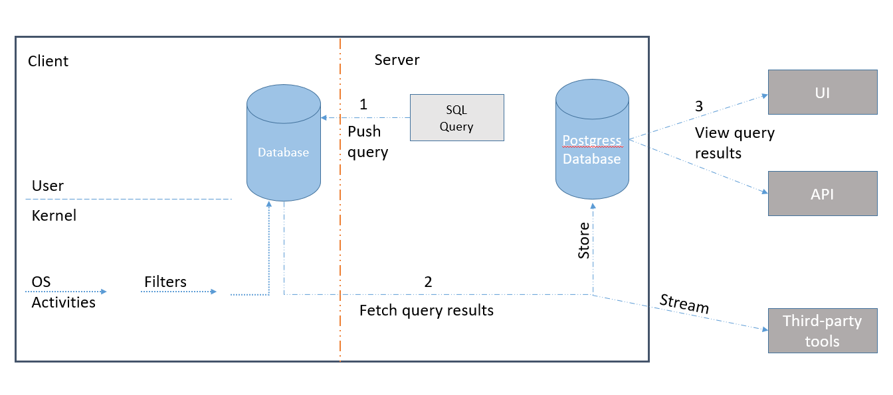
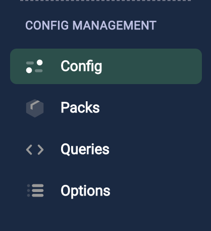
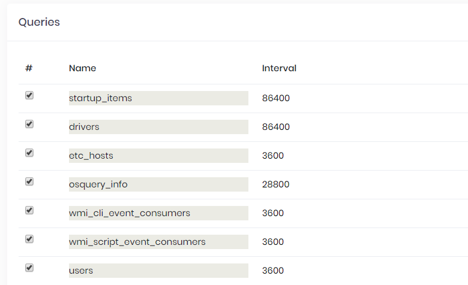
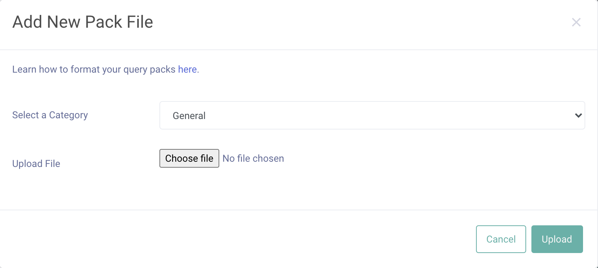
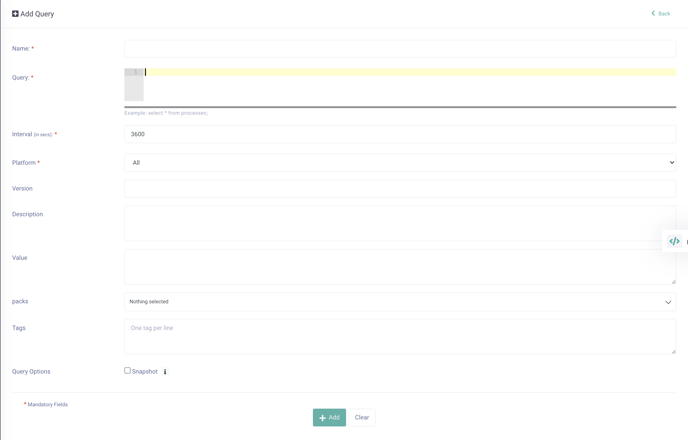
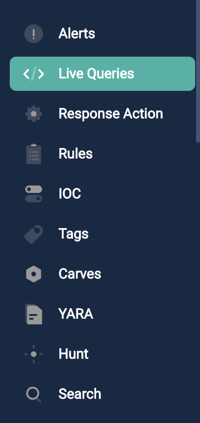

Using Queries
===================================
A query is a request for data or information from a database table or combination of tables. 
After the PolyLogyx client is provisioned, seeded queries are run on the managed endpoints and the fetched data is stored in the database on the PolyLogyx server. This data stored in [various tables](../12_Tables/Readme.md) and can be viewed or searched.
You can review, push, and and manage queries from the UI or by using APIs. This topic describes how to manage queries using the UI. For more information on managing queries using API, see [Rest APIs](../13_Rest_API/Readme.md).
   
Query Structure
--------------------
All queries you define or use in the PolyLogyx framework are defined using JSON syntax. 
Here is format used to define queries.

```
"table name": {
         "query": "select * from table  where column='value';",
         "interval": number of seconds,
         "platform": "operating system",
         "version": "x.x.x",
         "description": "this describes the query",
        "value": "Process Events",
         "removed": false
       },
 ```    
Here is an example.

```
"win_process_events": {
         "query": "select * from win_process_events  where action='PROC_CREATE';",
         "interval": 30,
         "platform": "windows",
         "version": "2.9.0",
         "description": "Windows Process Events",
         "value": "Process Events",
         "removed": false
       },
 ```

Query Workflow
--------------------
The following diagram depicts the high-level query workflow. 


1.	Query is pushed to the relevant nodes at the next configuration refresh interval. 
            
         Typically, queries (and packs) are applied using tags that are identifiers to help you logically group hosts. You can define tags using the Tag page and assign created tags to nodes using the Hosts page. 

2.	Query result is sent from the client database to the server database.  
3.	Query results can be viewed on the UI or by using APIs.
Steps 1, 2 and 3 apply to scheduled queries, query packs, and queries. Step 2 isn’t performed for Live queries. 

The client database can store up to 2500 events. If it receives more events, events older than an hour are deleted. These values are configurable. See [Configuring the PolyLogyx Client](../04_PolyLogyx_Client_Configurations/Readme.md) for more information. 
   
Types of Queries
-------------------- 
Here are the types of queries you can use.

| Type              | Description                                                                                                                                                                                                                                                               |
|-------------------|---------------------------------------------------------------------------------------------------------------------------------------------------------------------------------------------------------------------------------------------------------------------------|
| Scheduled queries | As the name suggests, scheduled queries run periodically to fetch the specified data for you. After the PolyLogyx client is provisioned and the connection to the PolyLogyx server is established, predefined queries are run to pull relevant information for each node. |
| Query packs       | A pack is a collection of queries. It allows you to logically group queries into categories. Once defined, you can run all queries included in a pack simultaneously.                                                                                                     |
| Queries           | A query is an individual request for data from a table or collection of tables. Define an individual query, as needed, to fetch data for nodes.                                                                                                                           |
| Live Queries      | A Live Query is suitable to meet your immediate and infrequent needs. It gives you a current snapshot of the nodes.                                                                                                                                                       |

Scheduled Queries 
-------------------- 
These out-of-box queries run frequently (as defined for the query) to fetch data from the nodes and require no configuration. 

Perform these steps to view or edit scheduled queries:
1. Access the web interface for the server.
2. Navigate to CONFIG MANAGEMENT  > Config.

   

   The page lists the predefined queries available for Windows, Linux, and Apple.  
3. Select an operating system, such as Windows.

   

4. Review the predefined queries applied on the Windows endpoints. 
5. Deselect a query to remove it from the applied client configuration. 
6. Optionally, modify the interval for a query to specify how often the query is run. The time duration (in seconds) specifies the duration after which the query is run on the client and query results are pushed to the server. 
7. Click Update to save your changes.

Query Packs
--------------------
By default, few packs are included with your PolyLogyx configuration.  You can add more packs, as needed, to meet your requirements. 

### Manage Existing Packs 
Perform these steps to view and edit packs:
1. Access the web interface for the server.

2. Navigate to CONFIG MANAGEMENT  > Pack.

    

3.	Review the available packs.

4.	Click a pack name to see the included queries.

5.	To apply a pack, specify the tag associated with the relevant nodes. All queries in the pack are applied to the associated nodes at the next config refresh interval. 


### Define a new Pack
Perform these steps to add a new query pack.

1. Access the web interface for the server.

2. Navigate to CONFIG MANAGEMENT  > Pack.

     
  
3. Click Add Pack.
   The Add New Pack File dialog is displayed. 
   
      
   
4.	Select a  category from the list. 

5. Click the Browse button to specify the pack file. 
   For more information on how to create a pack file, review this [page](https://osquery.readthedocs.io/en/stable/deployment/configuration/#query-packs). 
   
4.	Click Upload to create the pack.

Queries
--------------------
By default, multiple predefined queries are included with your PolyLogyx configuration. These are defined but not assigned to any nodes by default. 

### Manage Defined Queries 
Perform these steps to view or run a predefined query.
1. Access the web interface for the server.

2. Navigate to CONFIG MANAGEMENT  > Pack.

    
  
3.	Click a query to review its details.

4.	Click Run Live for a query to run it immediately. For more information, see Live queries. <add link>
   
5.	Specify the nodes on which to run the query by adding relevant tags. 


### Define a Custom Query
Perform these steps to add a new query:
1. Access the web interface for the server.

2. Navigate to CONFIG MANAGEMENT  > Pack.

     
  
3. Click Add Query.
   The Add Query page is displayed. 
   
      
   
3.	Enter the query details, such as name, query, interval, platform, and version.

4. Optionally, select a pack from the Packs list to associate the query with a pack.

5.	Optionally, assign tags to the query to run on associated nodes.

6.	Click Add to save the query. 


Live Queries
--------------------
When you run a Live query, the data is fetched and displayed to you immediately. If needed, you can save the data in an Excel or CSV file.
Perform these steps to define and run a live query:
1.	Access the web interface for the server.

2.	Navigate to SOC Operations > Live Queries.

      
   
      The Live Query Builder page is displayed.
   
3.	Specify the query to run in the Type your query here field.

    
    
4.	Select  hosts/tags to specify the nodes on which to run the query. 

      

5.	Click Run Query.
   The query results are displayed.
   
6.	Click Excel or CSV to save the data in Excel or CSV format, respectively.


|										|																							|
|:---									|													   								    ---:|
|[Previous << Understanding Filters](../05_Understanding_Filters/Readme.md)  | [Next >> Detection_Rules](../07_Detection_Rules/Readme.md)|
