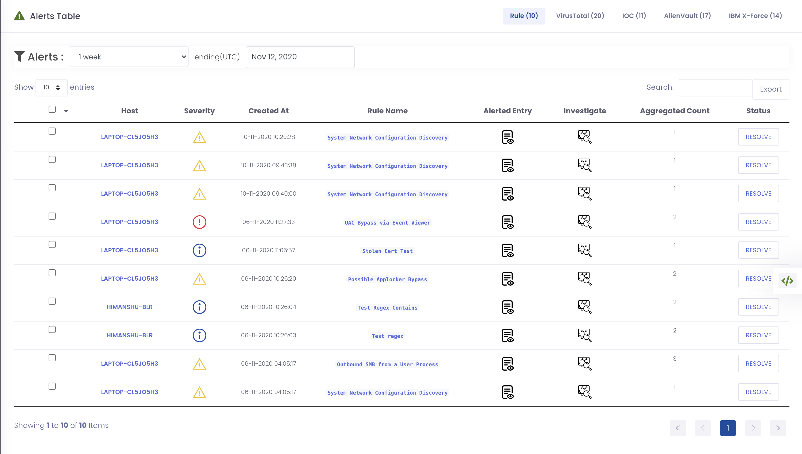
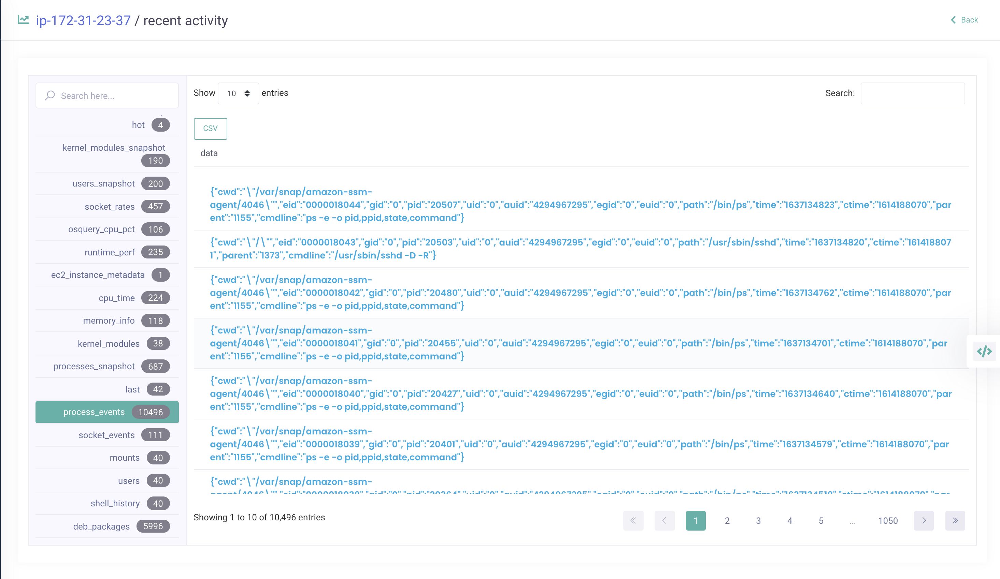
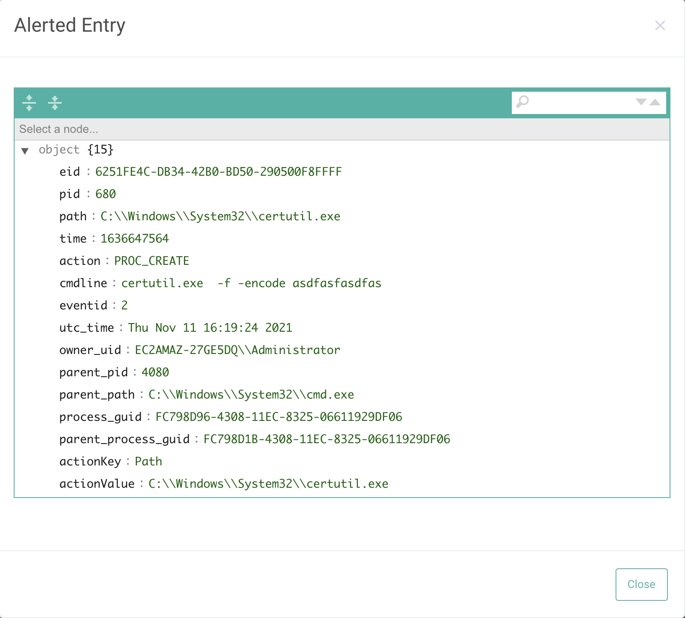
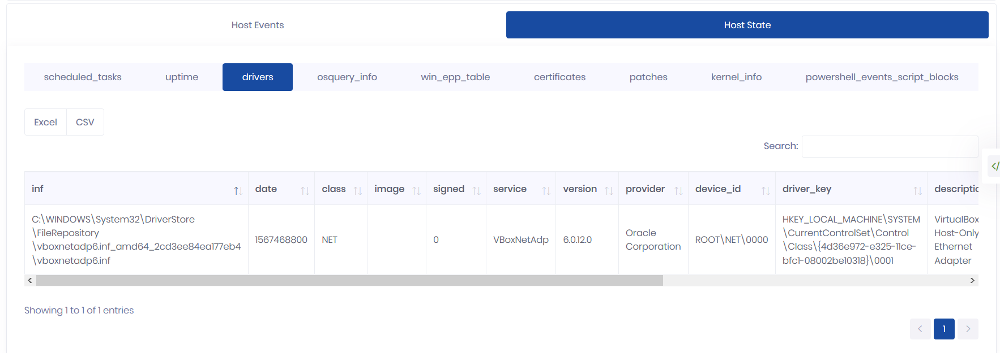
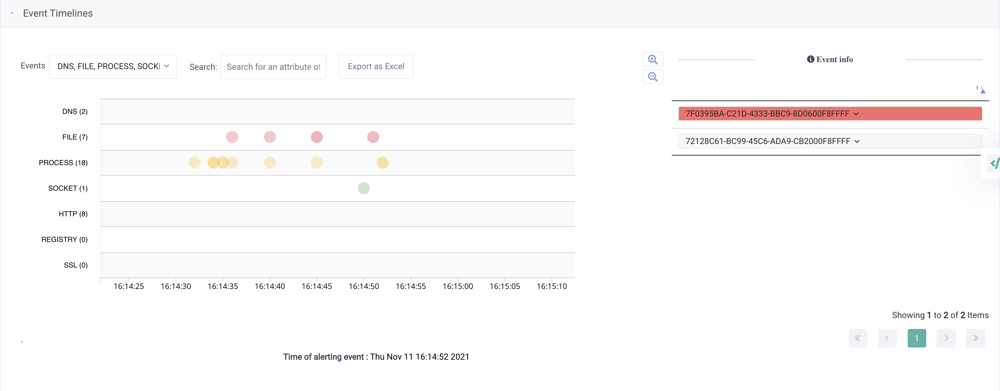
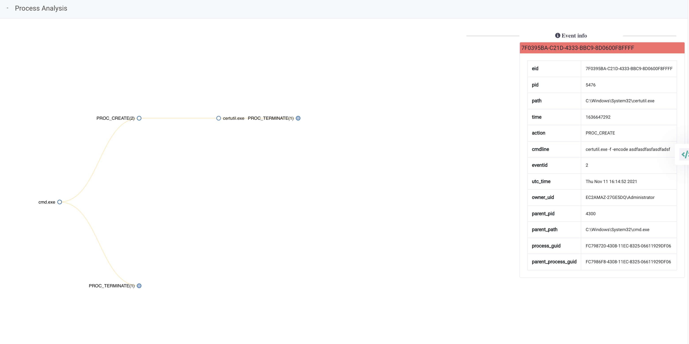
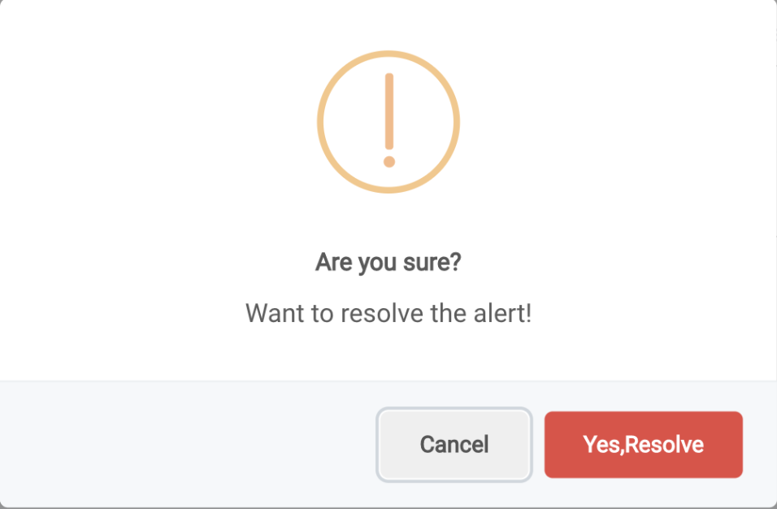

Managing Alerts
=================================== 
An alert indicates an important occurrence in the enterprise. An alert is generated when incoming event data matches a predefined rule or IOC, or when event data (for last 24 hours) matches the Threat Intel feed. 

The Alerts page is the central console that allows you to manage and review alerts. Click Alerts to view the Alerts page.


Review Alerts Traffic
--------------------

```diff
! Only available in the Enterprise Edition of the EclecticIQ ER. !
```
On the Alerts page, review the event timeline for your enterprise on the top bar to review the traffic trend. Each cluster on the timeline represents a collection of alerts. Hover over a cluster to see its details. Click on the event cluster to see the alerts present in that cluster.


Review Alerts 
--------------------
Click the AlientVault OTX, IBM X-Force, Rule, and VirusTotal tabs on the page to review the alerts based on the source generating the alerts. For example, when you click the Rule tab only the alerts generated based on predefined rules matching event data are displayed.



Perform these steps to review alert information:
1.	Click the node name to view endpoint details. 
    When you click a node, the recent activity page is displayed where you can run various queries to view node-specific information. Click the recent activity link for the node to review details.
   
   
    
2.	Review the severity information.
    For rule-based alerts severity values are none, info, warning, and critical. For alerts based on the Threat Intel data, severity values are low, medium, and high. 
3.	Click Intel Data for an alert to view the source data based on which the alert was generated. 
4.	Click Alerted Entry for an alert to view the event associated with the alert.
5.	Optionally, use the Search field to filter alerts based on a criteria.

Investigating Alerts
--------------------
```diff
! Only available in the Enterprise Edition of the EclecticIQ ER. !
```

Deep dive or investigate an alert to determine the actions you might need to take. 
Perform these steps to investigate an alert:
1.	Click Investigate for an alert. 
    The Alert Data page is displayed. 
    
     
2.	Review alert details.
    1. View alert-related details, such as node, severity, alert type, source, and intel data.
    2.	For rule-based alerts, the rule name field displays the rule that was matched for the generated alert. Click the rule name to view or update the predefined rule. 
    3.	If needed, click the node name to view endpoint details and run various queries to get node-specific information. Click recent activity to view latest node details.  Additionally, for node-specific information use the Search field available in the various tabs.   
    4.	Optionally, click View Intel Data to view the source data based on which the alert was generated. 
3.	Expand the Alerted Entry pane to view event-related details.
    1.	Review event-related details, such as ID, action, target path, and time. 
    
    
    2.	Optionally, click Alerted Entry to view the event. 
4.	Click the Host State tab to view node-related information. The displayed tabs vary based on the alert information.  (SIR)
    1.	View details in the various tabs, such as scheduled_tasks, uptime, drivers, certificates, and patches. 
    
    
    2. Optionally, for node-specific information use the Search field available in the various tabs.
5.  Click the Host Events tab to review node-specifc event details.
    1. Expand the Event Timelines pane.
    
    
    
       This depicts the node state around the time the event (associated with the alert) was generated. It provides a graphical view of events depicting event history for the node. The flashing bubble represents the event associated with the alert. By default, the time period for the event window is 30 seconds before and after the event is generated. Click the + button to zoom in and – button to zoom out. Click a bubble on the timeline to view the details for the associated events in the Event info pane.
    
    2. Expand the Process Analysis pane. 
    
    
    
    This depicts the process hierarchy of the process associated with the alert and its activities.
    
6.  Optionally, run a [Live query](../07_Queries_and_packs#live-queries) to fetch immediate results for the endpoint. 

Responding to Alerts
--------------------
Based on the alert severity and importance, you can take needed actions for an alert. You can choose to ignore it or act on it. For more information, see [Responses](../11_Responses).  

```
! Only available in the Enterprise Edition of the EclecticIQ ER. !
```

Closing Alerts
--------------------
After you have processed an alert, close it to remove it from the Alerts page.

Perform these steps to close an alert:
1. Access the web interface for the server.
2. Navigate to Alerts.
    
   
3. Click Resolve for an alert. 
   A message box is displayed. 
   
   
4. Click Yes, Resolve it to remove the alert from the Alerts page. 

|										|																							|
|:---									|													   								    ---:|
|[Previous << Detection Rules](../08_Detection_Rules/Readme.md)  | [Next >> Carves](../10_Carves/Readme.md)|
