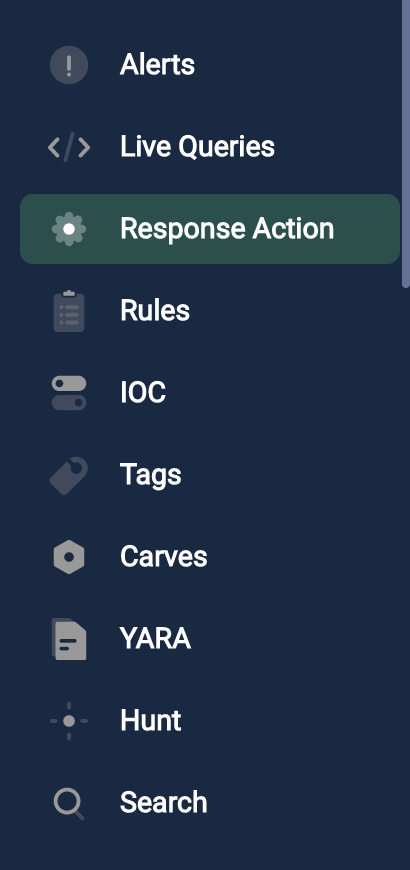
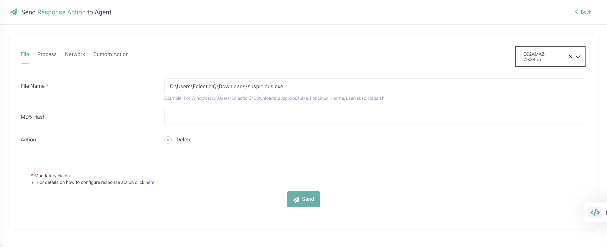
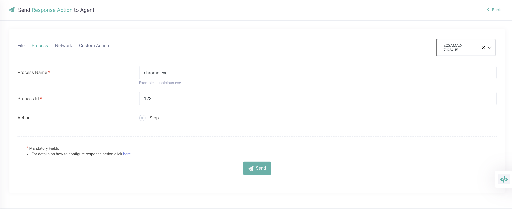
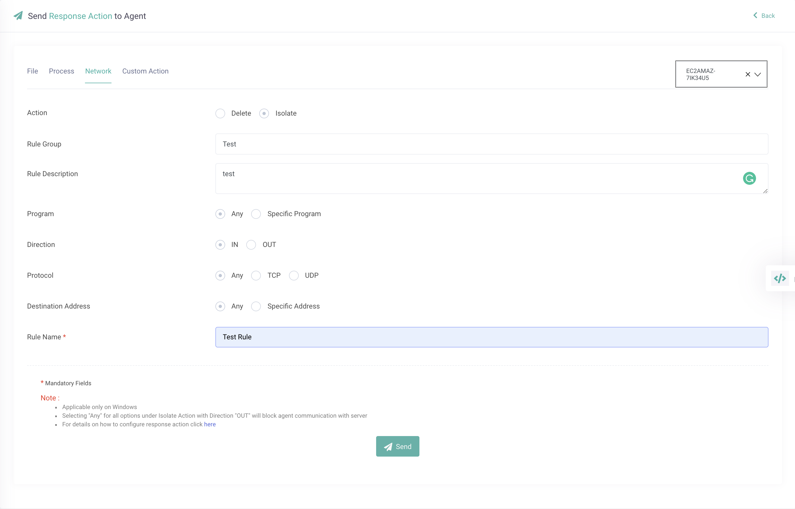
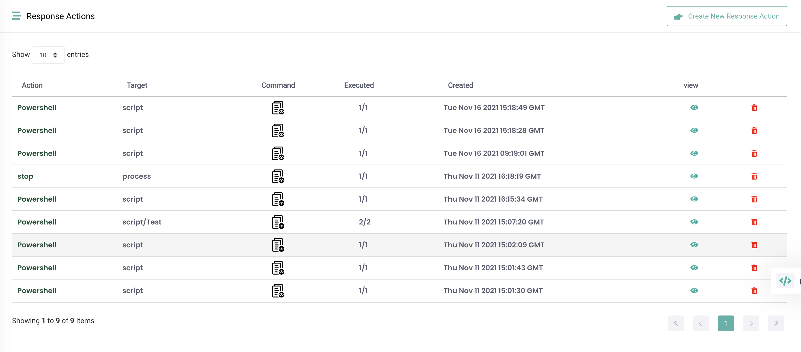

Response Actions
=================================== 

```diff
! Only available in the Enterprise Edition of the EclecticIQ ER. !
```


EclecticIQ ER platform provides the security administrator abilities to take certain controlled actions in response to the detection of an intrusion, or attempt of one. These actions can allow the admininstrator to:

a) Delete a file from the endpoint

b) Terminate a process on the endpoint

c) Push a host firewall rule on the endpoint for containment, or limit, the network access

d) Re-Start an agent remotely

d) Execute a shell command on linux and powershell/cmd command on windows systems

Sending "Response Actions" can be a powerful feature for responding to an incident on scale. However this feature, if not used properly, can be highly disruptve. It is stronly recommended that a script for custom respo be sent down this path with extreme caution. Some basic precautions are listed below:


1) Make sure the response capabilities of the target host shows enabled.


2) Only those scripts be sent which **DO NOT** require any user intervention on the host device.

3) Test the script on a standalone system to ensure it works as designed.

4) If the script does not return the output, DO NOT send another one without understading the reason of the previous failure.

The response actions are available on Windows and Linux endpoints only. 

**Note:** Response command can be sent to an offline host.


Perform these steps to take a response.
1. Access the web interface for the server.
2. Navigate to Response. 

   
3. Click Add Response. The Send Response to Agent page is displayed. 
   On this page, you can delete a file, terminate a process, isolate an endpoint from the network or execute a script.
   
   1. To delete a file, set the Target value to file, specify the full file name in the input text box, with the optional MD5 hash of the file, and the target endpoint.
   
   
   
   2. To terminate a process, set the Target value to process, specify the PID (process ID) and target endpoint.
   
   
   
   3. To isolate an endpoint using Windows Host Firewall interface, set the Target value to network and specify the other values. For details on the other values, see this [page](https://docs.microsoft.com/en-us/previous-versions/windows/it-pro/windows-server-2008-R2-and-2008/cc722141(v=ws.10)).
   
   
   
   3. To execute a powershell/batch/shell script, provide the content or upload the script file.
   
   
   
 4. Click Add to apply the changes.
 
    The response is created and listed on the Reponses page. 
    
 5. Review the response status to verify if the corresponding action was taken.  
 
    

    


|										|																							|
|:---									|													   								    ---:|
|[Previous << Carves](../10_Carves/Readme.md)  | [Next >> Tables](../12_Tables/Readme.md)|
